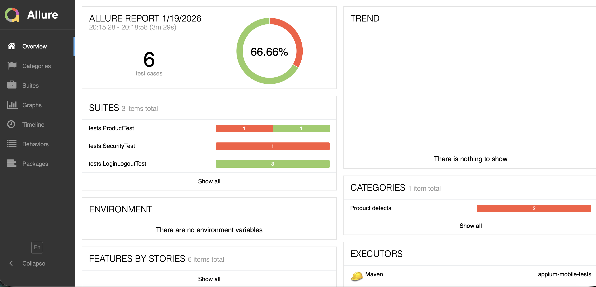

# 📱 Mobile Test Automation – Appium + Java

## 📌 Project Overview

This project contains automated UI tests for a mobile application written in Java using Appium and JUnit 5.

The goal of the project is to demonstrate:
* clean and maintainable test automation
* use of design patterns (Page Object Model, Builder) for easy test maintenance and scalability
* configuration management using environment variables
* professional handling of application defects

## 🛠 Tech Stack

* Java 21
* Appium
* Selenium
* JUnit 5
* Lombok
* Maven

* Allure Reports

## 🧱 Project Structure
```
src
├── main
│    └── java
│         ├── data          # Test data classes
│         ├── drivers       # DriverManager
│         ├── pages         # Page Object Model
│         └── utils         # ConfigReader
└── test
     ├── java
     │    ├── base          # BaseTest, ScreenshotTestWatcher
     │    └── tests         # Test cases
     └── resources
          ├── apps          # APK files
          └── config.properties
```

Practices and patterns used:
* Page Object Model (POM)
* Builder Pattern
* Lombok to minimize repetitive code
* Allure steps and annotations for readable test reports
* Allure reporting with screenshots on failure

## ⚙️ Prerequisites

1. **Java 21** installed

2. **Maven** installed

3. **Android Studio** with at least one Android emulator configured

4. **Appium** installed:
```bash
 npm install -g appium
 appium driver install uiautomator2
```

5. **ANDROID_HOME** environment variable set

6. Place the `Android.SauceLabs.Mobile.Sample.app.2.7.1.apk` file in `src/test/resources/apps/` folder.
   APK can be downloaded from: https://github.com/saucelabs/sample-app-mobile/releases

7. Start Appium server before running tests:
```bash
 appium
```

## ▶️ How to Run Tests

Default run (uses config.properties):
```bash
 mvn clean test
```

Run tests on a specific emulator (using environment variable):

macOS / Linux:
```bash
 DEVICE_NAME=Phone_API_36 mvn clean test
```

Windows PowerShell:
```powershell
 $env:DEVICE_NAME="Phone_API_36"
 mvn clean test
```

If environment variable is not provided, default value from `config.properties` is used.

## 🤖 Emulator Startup

For the purpose of this assignment, the Android emulator is started automatically at the beginning of the test execution.

* The emulator is started once before all tests run
* The emulator AVD name is taken from `DEVICE_NAME`
* The test execution waits until the emulator is fully booted
* Emulator startup logic is separated from test logic

## 📊 Reporting

The project uses Allure Reports to provide:
* clear test execution results
* business-readable test steps
* screenshots automatically attached on test failure



To generate and open the report:
```bash
 mvn allure:serve
```

## ⚠️ Known Issues

Some tests in this project are expected to fail due to defects in the application logic.

Example:
* User can complete checkout with an empty cart.
* Expected behavior: checkout should be blocked when cart is empty.
* Actual behavior: checkout proceeds without any products.

Failing tests are intentionally kept to:
* expose real application bugs
* demonstrate defect detection
* show proper documentation of known issues

This reflects real-world QA automation, where tests should reveal bugs, not hide them.

## 📝 Notes

* Project is Android-only. For iOS support, change `AndroidDriver` to `AppiumDriver` and add XCUITest configuration.
